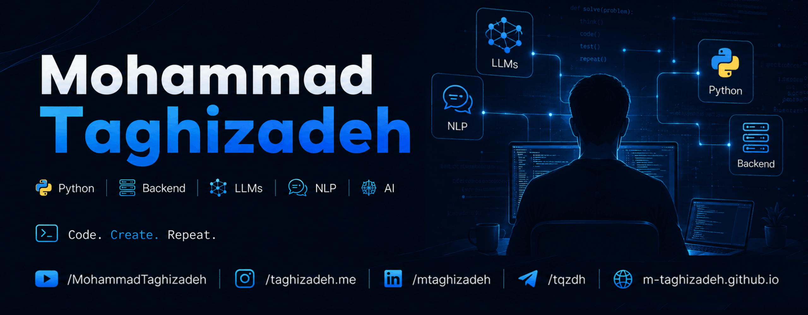

# Hi, this is **Mohammad Taghizadeh** :) 

I'm a software developer with professional experience in multiple programming languages. My main passion is **Python** (since 2018), along with backend development, artificial intelligence, and creating high-quality educational content.

My mission is to empower Persian-speaking developers by creating high-quality programming courses and educational content. I regularly publish educational videos on **YouTube** and develop comprehensive online courses.

### Areas of Expertise
- Python Programming
- Backend Development (Django, Flask, FastAPI)
- Artificial Intelligence (AI)
- Machine Learning (ML)
- Deep Learning
- Natural Language Processing (NLP)
- Large Language Models (LLMs)
- Computational Linguistics
- Computer Vision
- Search Engine Development
- Face Detection & Face Recognition
- Web Scraping & Web Crawling
- Parallel & Concurrent Programming in Python
- Software Architecture & Design Patterns
- Teaching Programming and Creating Educational Content
- Java Programming & Desktop Application Development

### Interests
- Reviewing other developers' code and understanding different approaches to problem-solving
- Creating programming courses and educational content
- Learning new technologies and sharing knowledge
- Football
- Mixed Martial Arts (MMA)
- Table Tennis
- Listening to Podcasts
- Philosophy
- History of Iran and World History

<table>
  <tr>
    <td>
      
    </td>
    <td>
      
    </td>
  </tr>
</table>

  

  

  

### Connect with Me

